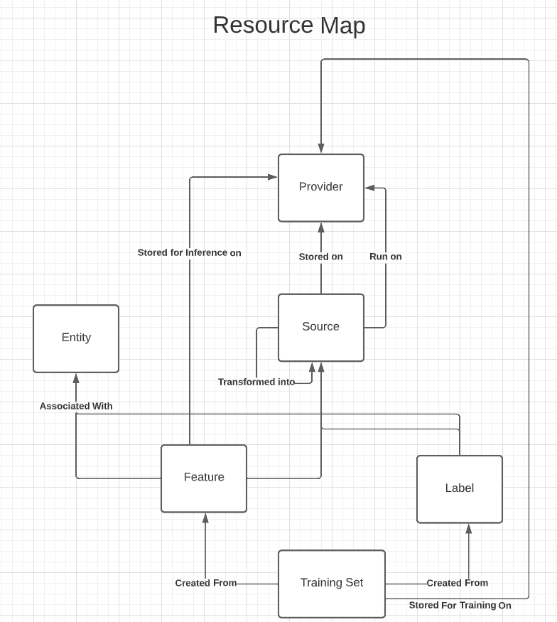

# Overview

## Introduction

Featureform allows data scientists to define their model's features, labels, and training sets in their logical representations. In reality, the logical definitions are split across different real components: the data source, the transformations, the inference store, the training store, and all their underlying data infrastructure. Featureform then coordinates a set of infrastructure providers to make the real components match each resource's logical representation.

Those real components can then be served for training and inference, and the logical resources can be explored via the feature registry. Our enterprise edition also provides support for access control, audit logs, and other governance capabilities.

## Using Featureform

### Configure Infrastructure Providers

Featureform coordinates a set of infrastructure providers to act together as a feature store. Before transformations, features, and other resources can be defined, an initial set of providers must be configured. This is done via a Python API and applied via the Featureform CLI.


[registering-infrastructure-providers.md](registering-infrastructure-providers.md)


### Define Features, Labels, and Training Sets

Once the infrastructure is configured, features and training sets can be created. This begins by registering a set of primary data sources, often followed by defining a DAG of transformations. Once the transformed sources are created, features and training sets can be defined. Other metadata such as descriptions, variants, and names are also defined in this step. In the enterprise editions, governance rules that the organization created will be enforced here. All these steps are done via a Python API and applied via the Featureform CLI.


[defining-features-labels-and-training-sets.md](defining-features-labels-and-training-sets.md)


### Serve for Inference and Training

Once the training sets and features have been created, they can be served. Featureform provides a Dataset API for training and an Inference API for feature serving.


[serving-for-inference-and-training.md](serving-for-inference-and-training.md)


### Explore the Feature Registry

Whether working alone locally or as part of a large enterprise organization, Featureform resources can be explored via the Feature registry. It provides data lineage, transformation logic, ownership, and more. A user can see which models are using which features, which features are stored on which providers, and other cross-sections of exploring the metadata.


[exploring-the-feature-registry.md](exploring-the-feature-registry.md)


## Resource Types

To use Featureform, a user will define all of their resources declaratively in Python, and use the CLI to apply it. Featureform will then create all the required resources via the registered providers. It will schedule and run the required transformations to create the defined features and training sets.

### Provider

Featureform orchestrates a set of underlying storage and compute providers. These providers handle storing sources, transforming them, and acting as inference stores.

### Source

A source is a dataset that features and labels can be registered from. There are two kinds: primary and transformation.

#### Primary

Primary sources are the original data sources that are passed into Featureform. Featureform will not change them.

#### Transformation

New sources can be created through transformations on other sources. These transformations can be anything from SQL queries to PySpark jobs to local python functions. Transformations can be chained together and form a directed acyclic graph (DAG).

### Entity

All features describe one or more entities. The entity column in a feature acts like a primary key. Common entities include user, item, and transaction.

### Feature

A feature is an input to a model. It's linked with an entity field, and optionally a timestamp field. It's registered on an existing source.

### Label

A label is a value that a model should predict at training time. It is linked with an entity field, and optionally a timestamp field. It's registered from an existing source.

### Training Set

A training set is composed of one label and one or more features. The labels and features are joined together by their entity fields. If they are linked with timestamp fields, [point-in-time correct training sets](defining-features-labels-and-training-sets.md#point-in-time-correctness) will be created.

### Model

A model name is a logical grouping mechanism for features and training sets. Models can be registered independently of features or training sets _or_ they can be [registered at the time of serving these resources for training or inference](serving-for-inference-and-training.md#model-registration).
